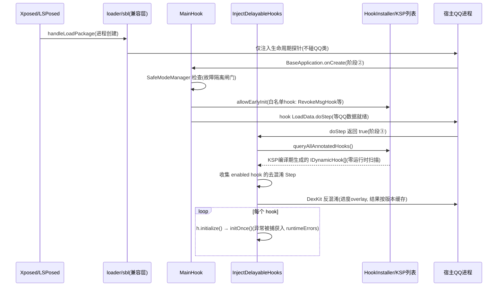
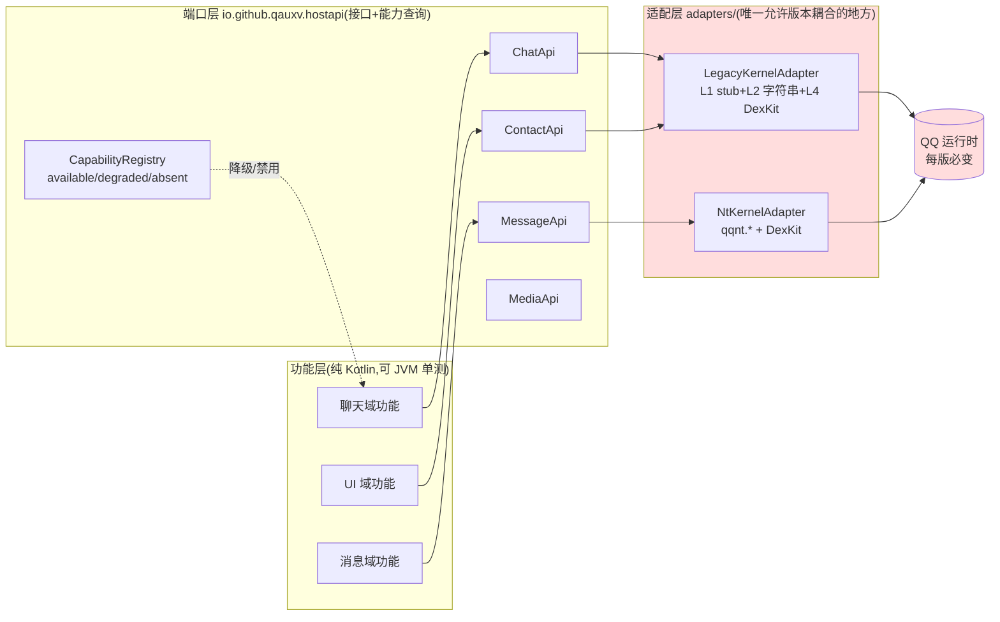

# Qself（QAuxiliary fork）架构原理剖析与重构提案

> 阶段：**Phase 0 — 分析先行**（按约定：本文档评审通过后才动代码）
> 首要目标：**演进能力 / 版本解耦** —— 隔离「功能逻辑」与「版本耦合的类查找」，使 QQ 版本更新时只改适配层
> 兼容性约束：**允许破坏性变更**（个人 fork，可接受配置重置）
> 交付节奏：**先补测试安全网，再重构**

---

## 0. 方法论：为什么「演进能力」是本项目的第一变化轴

Parnas（1972）在《On the Criteria To Be Used in Decomposing Systems into Modules》中的核心论断：**模块划分的依据不是功能步骤，而是"什么会变"**。把最容易变化的设计决策藏进各自独立的模块，才能让变化的代价局部化。

对这个仓库，变化频率排序是明确的：

| 变化轴 | 频率 | 证据 |
|---|---|---|
| **QQ 版本（混淆名、类结构、NT 内核迁移）** | 每一两周一个版本 | 150 个 `DexKitTarget` 按版本缓存；`QQVersion` 常量文件持续追加 |
| 功能增删 | 中 | 304 个 `@FunctionHookEntry` |
| Xposed 框架 API（LSPosed 100/101、libxposed、Frida） | 低 | `loader/sbl` 已做了完整抽象 |
| Android 平台 | 极低 | — |

**原理性结论**：变化最快的轴（QQ 版本）本应是模块边界的第一优先级，但现状是它以五层不同形态（见 §2）弥散在 287 个文件里。这就是"每次 QQ 更新 = 全树风险面"的根源。重构的主轴因此确定为：**把版本耦合从功能的内聚单元中抽出，收敛到显式的适配层**。

---

## 1. 运行时原理剖析（先理解，再评判）

### 1.1 三阶段启动时序

```
阶段① 框架注入(进程创建即执行)        阶段② 应用就绪(classloader 可用)      阶段③ 数据就绪(QQ 自身启动完成)
┌─────────────┐                    ┌──────────────────┐              ┌─────────────────────────┐
│ LSPosed/Frida│                    │ BaseApplication    │              │ LoadData.doStep() 返回后  │
│ → loader/sbl │──hook──▶           │ .onCreate          │──hook──▶     │ InjectDelayableHooks     │
│  多框架兼容层 │                    │ → MainHook         │              │  .step(director)         │
│              │                    │  .performHook()    │              │  → 批量初始化全部 hook    │
└─────────────┘                    └──────────────────┘              └─────────────────────────┘
   仅装生命周期钩子                    仅 earlyInit 白名单 hook            + DexKit 去混淆(带进度 UI)
```



**每一级延迟都有原理性理由**，重构必须保留：
- **阶段①→②**：QQ 的 classloader 在 `handleLoadPackage` 时尚未完全可用，过早 `loadClass` 直接 `ClassNotFoundError`；
- **②→③**：`LoadData.doStep` 完成意味着 QQ 账号数据结构就绪，大量 hook 目标类此时才被加载；且后台启动路径（`stepForMainBackgroundStartup`）允许把重活挪出用户可感知窗口——**启动时序本质上是"注入时机 ⊆ 目标类生命周期"的偏序问题**；
- **安全模式**：`SafeModeManager` 是引导期故障隔离——上一轮崩溃后可只加载 `SettingEntryHook` 进入设置页自救，这是 Xposed 模块能在宿主进程里活下去的底线设计。

### 1.2 注册机制：KSP 编译期代码生成

`@FunctionHookEntry`（304 处）/ `@EntityAgentEntry` / `@UiItemAgentEntry` 由 `libs/ksp` 的处理器在**编译期**生成 `AnnotatedFunctionHookEntryList`，返回全量 hook 数组。

**原理**：宿主进程内运行时类路径扫描（classpath scanning）的代价是启动期几十到几百 ms，且在 QQ 的加固/多 classloader 环境下不可靠。编译期收集把 O(n) 的运行时成本转移到构建期，是本项目**最值得保留的架构决策**。

失败模式也被显式设计过：生成类初始化抛 `ExceptionInInitializerError` 时，退化为只含 `SettingEntryHook` 的数组（`HookInstaller.queryAllAnnotatedHooks`），保证设置入口永远可达。

### 1.3 Hook 分类学与状态机

```
IDynamicHook (契约: isEnabled/isInitialized/initialize/isPreparationRequired...)
 └─ BaseFunctionHook (hook key + 配置绑定 + DexKit 依赖声明)
     ├─ CommonSwitchFunctionHook   ← 开关型功能(占绝大多数)
     ├─ CommonConfigFunctionHook   ← 有配置 UI 的功能
     ├─ BasePersistBackgroundHook
     └─ BaseHookDispatcher<T>      ← 一个注入点 ÷ N 个功能(见 1.4)
```

`initialize()` 实现了**幂等 + 异常围栏**：结果缓存于 `mInitialized/mInitializeResult`，任何 `Throwable`（`Error` 中的 OOM/SO 除外）被吞入 `runtimeErrors` 供 UI 呈现。原理：单个功能的失败被限制在该功能的边界内，不污染宿主进程。

### 1.4 Dispatcher–Decorator：注入点复用模式

`StartActivityHook : BaseHookDispatcher<IStartActivityHookDecorator>` 一次性 hook `startActivity`，再把事件分发给 4 个 `decorator`（`FxxkQQBrowser`、`ForceSystemAlbum`…）。

**原理**：Xposed 的每个 hook 回调都有永久性运行时开销（ArtMethod 入口改写 + 回调链表），且多个功能 hook 同一方法存在**顺序耦合**。Dispatcher 把「注入」与「逻辑」分离：注入点只装一次，功能以纯 Kotlin 接口实现的形式插入——这实际上已经是一个**朴素的端口-适配器结构**，本提案（§3）是把它推广到"类/成员查找"这个更深的耦合层。

**现有缺陷**：decorator 列表是手写数组（`arrayOf(DisableQzoneSlideCamera, FxxkQQBrowser, ...)`），违反 OCP——增删功能必须改核心分发器，也放弃了 KSP 注册机制本可提供的自动发现。

### 1.5 版本查找的五层现状（演进能力问题的实体）

| 层 | 机制 | 规模 | 性质 |
|---|---|---|---|
| L1 | `libs/stub/qq-stub` 子模块，**编译期类型安全** | 65 个文件直接 `import com.tencent.*`（41 个 import NT 内核 `qqnt.*`） | 编译时可查，运行时靠 ProGuard/混淆前的全限定名匹配 |
| L2 | `Initiator` 字符串类查找 + 55 个 `_Xxx()` 版本兼容获取器 | 226 个文件用 `Initiator`；**全仓 1222 处硬编码 `com.tencent.*` 字符串，分布在 287 个文件** | 运行时惰性解析 + 缓存，找不到返回 null |
| L3 | `Reflex`（cc.ioctl.util）按混淆字段名(`"a"`)反射 | 99 个文件 | 最脆：混淆名每版必变 |
| L4 | DexKit 特征反混淆（`DexKitTarget` sealed class，150 个目标，trait 字符串 / StringVector / bridge lambda 四种策略） | 141 个文件引用 | **按版本号缓存解析描述符**（`cache#$name#$version`），是现有的、也是最成熟的版本适配资产 |
| L5 | 版本门控 `requireMinQQVersion`/`isQQnt()` 等 | 452 处实际调用（含 import/定义约 600 处） | 运行时能力开关 |

**原理性诊断**：这五层是正确的**技术**集合，但它们的**部署位置**错了——查找逻辑与功能逻辑交织在同一个方法体里（例：`QAppUtils.getAppRuntime()` 同时包含反射链构造与业务语义）。信息隐藏要求"每个预计变化的决策对应一个隐藏它的模块"，而现状是 1222 个变化点散布在 287 个文件。QQ 更新时的 diff 无法被"看一眼 adapter 目录"穷尽。

### 1.6 装载层（loader/*）：已完成的样板工程

`loader/sbl` 对 LSPosed 100/101/10x、libxposed、Frida 做了完整的多框架兼容（`IHookBridge`/`ILoaderService` 抽象），`loader/hookapi` 定义与注入实现（LSPlant）的接口契约。**这是本仓库里版本/框架解耦做得最好的部分，其"接口在下、实现在上"的结构正是 §3 提案的原型。**

---

## 2. 病理清单（原理 → 证据 → 后果）

**P1 · 版本耦合弥散（首要病理）**
- 原理：模块边界未对齐主变化轴（§0）。
- 证据：§1.5 表格；硬编码类名分布 `io.github.qauxv 347 / cc.ioctl 284 / cc.hicore 122 / xyz.nextalone 70 / com.xiaoniu 65 / me.singleneuron 23 / top.linl 19 / nep.timeline 8`——没有哪个包是"适配层"。
- 后果：QQ 每版更新，维护者必须在全树做考古；新功能作者复制旧功能的"字符串+反射"风格，债务自增殖。

**P2 · 依赖方向倒置**
- 原理：DIP——核心/基础设施不应依赖外围贡献者包；被多方依赖的工具应处于依赖图的最内层。
- 证据：核心包 `io.github.qauxv` 反向 import 作者包 **168 处**（`cc.ioctl.util.HostInfo` 21、`cc.ioctl.util.Reflex` 17、`LayoutHelper` 10…）；最刺眼的是**核心版本适配设施 `DexKitTarget` import 了 `me.ketal.data.ConfigData`**（作者包）。
- 后果：包重组（Phase 4）会引发雪崩式改动；核心的任何"收拢"都被作者包反向锁死。

**P3 · 注册机制双轨制**
- 原理：同一关注点（功能发现）应只有一条装配路径（单一机制原则）。
- 证据：hook 实体走 KSP 自动发现；decorator 走手写数组（§1.4）；`InjectDelayableHooks`/`MainHook` 里还残留按名引用的白名单。
- 后果：三条路径各有失效面；新增功能的心智成本高。

**P4 · 测试面为零**
- 证据：`app/src/test` 不存在；`androidTest` 仅一个 junit 依赖；CI（push_ci.yml）只 build 不 test；本沙箱无 JDK/Android SDK（编译验证需依赖 CI 或先 `apt install openjdk-17-jdk` + 纯 JVM 模块策略，见 §4）。
- 原理：重构的安全网 = 对"不变式"的可执行断言。没有测试的重构是"重写"，行为漂移不可检测——这正是你选择"先补测试"的合理性所在。

**P5 · 包按作者划分（反域内聚）**
- 证据：14 个顶层作者命名空间（`cc.ioctl` 234 文件、`io.github` 265、`me.*` 123、`xyz.*` 36…），Java 309 / Kotlin 411 混杂。
- 后果：功能内聚度低（同一聊天域的功能散在 5 个包）；新人无法按域导航。属 Phase 4，优先级最低（因为允许 breaking，但收益也最" cosmetic"，应最后做）。

---

## 3. 目标架构提案：HostApi 端口-适配器（Ports & Adapters）

### 3.1 结构



**核心规则（可被 lint/CI 强制）**：
1. `feature/**` 禁止出现 `com.tencent` 字符串、`Initiator`、`Reflex`、`DexKit` 引用；
2. `adapters/**` 是 L1–L5 五层技术的**唯一**驻地；
3. 端口方法返回领域类型（data class），不泄漏 `Class`/`Method`/宿主对象；确需传递宿主对象时用 `opaque handle` + 适配器内解释；
4. 端口实现懒加载，解析失败 → `CapabilityRegistry` 标记 `absent` → 功能自禁用并上报（把 §1.3 的异常围栏升级为**能力级降级**）。

### 3.2 与现有资产的映射（绞杀者模式，不是重写）

- `DexKitTarget`（150 个，带版本缓存）整体平移为 adapter 内部实现细节——它是已验证的反混淆资产，**不动它的逻辑，只动它的可见性**；
- `BaseHookDispatcher` 的 decorator 接口即天然的端口雏形，试点从 decorator 类功能开始（改动半径最小）；
- KSP 注册机制保留并**扩展**：新增 `@HostAdapterEntry`，decorator/adapter 全部走编译期发现，消除手写数组（P3）；
- `Initiator` 的 67 个 `_Xxx()` 获取器标记 `@Deprecated`（internal），逐域迁入 adapter。

### 3.3 权衡（原理性诚实）

- **代价**：接口层引入间接性，简单功能（一行 hook）会被拆成 2 个文件；端口设计错误会导致返工。缓解：端口按域（Chat/Message/…）而非按功能定粒度，且**只在迁移功能时才定义端口**（pull-based，不预先设计大而全的 API）。
- **收益判定标准**（可量化）：下一次 QQ 不兼容版本发布时，理想 diff 只落在 `adapters/**` 与 `DexKitTarget` 追加；以此作为 Phase 2 试点验收的观测指标。

---

## 4. 测试安全网设计（先于一切代码改动落地）

| 层级 | 对象 | 运行环境 | 可行性依据 |
|---|---|---|---|
| **A. 纯 JVM 单测**（Phase 0 已落地：`app/src/test`） | `DexMethodDescriptor` 解析、`QQVersion` 常量表、`SyncUtils` 进程位图、`Initiator` 名字解析语义，及未来被抽出的纯逻辑 | `./gradlew :app:testDebugUnitTest`（GitHub Actions `test.yml`） | 无 Android 类型引用即跑；`returnDefaultValues=true` 兜底 |
| **A+. 纯 JVM 模块**（Phase 1+ 演进） | 随 hostapi 重构从 app 模块抽出的 feature/端口逻辑 | 独立 `kotlin("jvm")`/`java` 模块 | 原理修正：AGP 产物无法被纯 JVM 模块消费，故 P0 先用 `app/src/test`；逻辑一旦抽出即可升格为独立模块 |
| **B. 适配器契约测试** | 每个 adapter 的"符号可解析性 + 行为" | JVM + fake classloader：把 `qq-stub` 子模块 jar 作为假宿主 classloader 注入 `Initiator`（钩子 `initForTest` 已落地） | stub 本身就是稳定版 QQ 类集 |
| **C. 模块自诊断** | 真机运行后收集全部 hook 的 `isInitializationSuccessful/runtimeErrors` 生成报告（现有 `RuntimeErrorTracer` 已有数据，缺聚合出口） | 设备/用户 | 可观测性作为测试策略的一部分 |

**环境事实（2026-09 实测）**：开发沙箱网络为"仅 github.com 白名单"——Gradle 发行版、Maven Central、dl.google.com、JITPack 均不可达（探测矩阵见 `dev-env.md`），apt 亦不可用。因此**CI 是唯一测试执行环境**，本地（含沙箱）只做静态验证；全网络环境可用 `./gradlew :app:testDebugUnitTest` 本地复跑。

---

## 5. 分阶段实施计划（每阶段有独立验收，可随时叫停）

| 阶段 | 内容 | 验收标准 | 风险 |
|---|---|---|---|
| **P0 文档+骨架**（本文件） | 测试源集/JVM 子模块/CI test job；首批 Layer A 测试；`Initiator` 测试钩子 | CI 全绿；测试数 >0；文档评审通过 | 低 |
| **P1 核心接缝** | ① `cc.ioctl.util` 中被核心依赖的工具（HostInfo/Reflex/LayoutHelper）迁入 `io.github.qauxv.util`；② 引入 `hostapi` 包骨架 + `CapabilityRegistry`；③ decorator 注册 KSP 化 | 核心包对作者包 import 从 168 → <80；全量编译通过；无行为变化 | 中（纯移动，量大但机械） |
| **P2 试点迁移** | 选 2–3 个低风险 decorator 功能（`FxxkQQBrowser`/`ForceSystemAlbum`/`RemoveCameraButton`）拆成 feature+adapter+契约测试 | 试点行为等价（真机抽查）；契约测试覆盖其符号依赖 | 低 |
| **P3 NT 适配正式化** | 定义 `MessageApi`/`ChatApi` 等核心端口；迁移 41 个 `qqnt.*` import 文件中的高价值功能 | 端口覆盖 ≥5 个域；新版本日 diff 集中度观测 | 中高（接口设计风险，pull-based 缓解） |
| **P4 包重组**（breaking） | 作者包 → 功能域包；配置 key 迁移工具（允许 breaking，但提供一次性映射）；CI 增加依赖方向检查 | 顶层包数 ≤6；依赖检查 job 拦截倒置 | 中（机械但需一次性完成） |

---

## 6. 决策记录（ADR，已拍板）

| # | 决策 | 理由 |
|---|---|---|
| D1 | 端口**按域**组织（`ChatApi`/`MessageApi`/…），域内按能力拆 interface | 域数量稳定（≈聊天/消息/联系人/媒体/UI），能力会增长；Kotlin 多接口实现无成本 |
| D2 | decorator 注册**全 KSP 编译期发现**，删除手写数组，用优先级注解控制顺序 | 消除注册双轨制（P3）；保留确定性（KSP 生成有序数组） |
| D3 | 契约测试**不引入 Robolectric**，用 fake classloader（`qq-stub` 注入） | 依赖重、与纯 JVM 目标冲突；stub 即稳定宿主快照 |
| D4 | Phase 4 目标命名空间 **`sumicya.qself.*`**（`sumicya.qself.feature.<域>` / `sumicya.qself.hostapi` / `sumicya.qself.adapter.<内核>`） | fork 品牌独立，避免与上游 `io.github.qauxv` 混淆；一次性迁移（允许 breaking） |
| D5 | 测试执行环境 = **CI-first**（`test.yml`）；沙箱只做静态验证 | 沙箱网络仅 github.com 白名单（见 §4）；CI 为权威执行器 |
| D6 | `sumicya.qself` 迁移放在 P4（最后），先解耦后搬家 | 先改依赖方向再改名字，避免 168 处反向 import 引发的雪崩与解耦工作互相干扰 |

## 7. P0 执行记录（2026-09-05）

1. **测试骨架落地**：`app/src/test` + `:app:testDebugUnitTest` CI job（`.github/workflows/test.yml`）。
2. **首批安全网（4 个测试类，~30 断言）**：`QQVersionTest`（常量表唯一性/严格递增/锚点）、`SyncUtilsProcessMapTest`（进程位图单比特不变式）、`InitiatorTest`（名字归一化/缺类语义，配套生产钩子 `Initiator.initForTest`，为 P0 唯一生产改动）、`DexMethodDescriptorTest`（描述符文法全量钉死）。
3. **安全网首轮即捕获存量 bug**：`DexMethodDescriptor.splitParameterTypes` 存在 off-by-one——`L`/`[` 分支推进游标后循环尾再 `i++`，**吞掉对象/数组类型参数的后一个参数**；唯一生产调用点 `LibXposedNewApiByteCodeGenerator.referenceMethod` 据此生成 `ImmutableMethodReference`，参数被吞 = 代理字节码签名错配。修复与暴露测试分两个 commit（git 历史保留红→绿证据链）。
4. **环境结论**：沙箱网络矩阵（github.com 通 / Gradle·Maven·Google·JITPack·Adoptium 全断）→ 本地构建物理不可能，`dev-env.md` 记录复现方法。
8. **P0 收口（2026-09-05）**：run 33969225216 全绿。`:app:testDebugUnitTest` 从零到 CI 常驻门禁；当日产出 = 安全网(4 测试类) + 2 个存量 bug 修复 + 注解回传通道 + 本文档。P1（核心接缝）无需额外权限，可自主推进。
6. **安全网第二个存量发现（CI 注解回传，2026-09-05）**：`Initiator.checkHostHasClass` 未初始化时 NPE——与 `load()` 的 fail-safe 契约不对称。按“无宿主 ⇒ 无该类”语义加固返回 false。至此测试落地当日：1 个描述符解析 bug + 1 个契约不对称，P0 投入产出比成立。7. **注解回传通道**：run 日志域名被墙，但 check-run 注解走 api.github.com 可读；test.yml 已内置“失败测试 → 注解”步骤，沙箱可自主闭环排障（本轮即靠它定位）。
5. **GitHub 侧阻塞**：本仓库为 cinit/QAuxiliary 的 fork 且 Actions 默认禁用；token 亦无 `workflows` 权限 → `test.yml` 暂存本地待所有者启用 Actions 后落地（详见 `dev-env.md` §4）。

---

## 附：证据采集命令（可复现）

```bash
# 硬编码宿主类名
grep -rEho '"(L?com[/.]tencent[/.][A-Za-z0-9/$._]+)"?' --include=*.java --include=*.kt app/src/main/java | wc -l   # → 1222
grep -rEl  '(同上)' app/src/main/java | wc -l   # → 287 文件
# 依赖方向倒置
grep -rh '^import (cc\.ioctl|cc\.hicore|me\.|xyz\.|nep\.|top\.|com\.xiaoniu|cn\.lliiooll|moe\.|wang\.|name\.|im\.mingxi)' \
  app/src/main/java/io/github/qauxv --include=*.java --include=*.kt | wc -l   # → 168
# 注册与门控规模
grep -rl '@FunctionHookEntry' app/src/main/java | wc -l        # → 304
grep -rn 'requireMinQQVersion(\|isQQVersion(' app/src/main/java --include=*.java --include=*.kt | wc -l   # → 452
# Initiator 版本兼容获取器
grep -cF 'public static Class<?> _' app/src/main/java/io/github/qauxv/util/Initiator.java   # → 55
```

*文档生成于 2026-09-05，基于 commit `37ca88e`（branch `arena/01a0718a-qself`）。*
