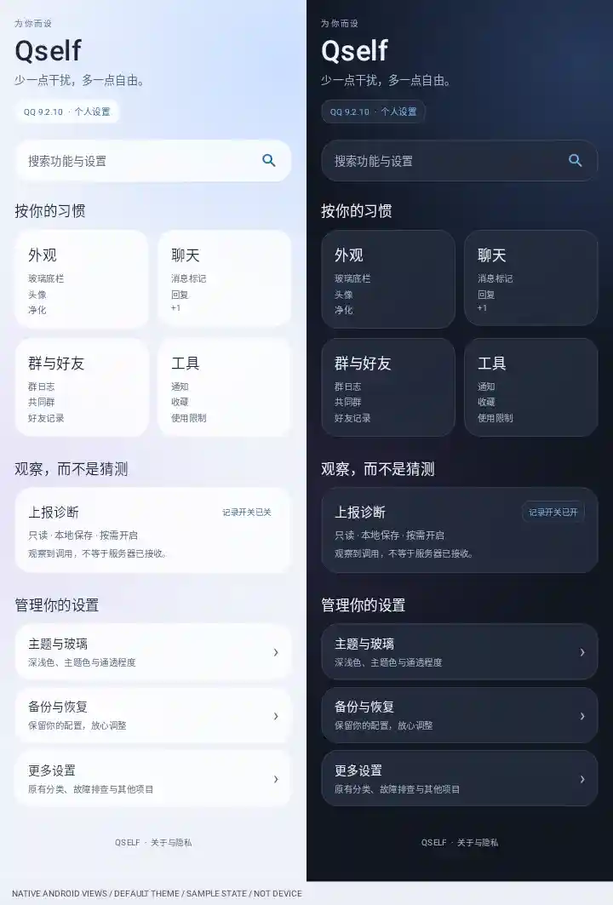

# 设置视觉改版（历史版本，已有实测缺陷）

> **不要继续安装本文的 3059 版。** 用户实测发现首页严重收窄、裁切；旧测试没有覆盖真实父容器测量。
> 本文保留当时的构建数据，但“完成”的验收结论已被推翻。修正版见 [04-settings-repair.md](04-settings-repair.md)。

## 实现范围

这次修改的是真实 Android 模块设置页，不是 Web 演示。

- 默认首页：四组常用功能、原生搜索入口、上报诊断状态、主题、备份、更多设置、关于。
- 四组是展示层快捷分类；沿用原 UiAgentItem，未复制开关存储、绕过不支持确认或自动开启 Hook。
- 更多设置仍保留原路由树；全局搜索仍检索所有注册项目，支持跳转定位。
- 设置主列表、层级配置页和搜索结果使用统一的静态玻璃背景与卡片。
- 深浅色随现有主题模式，主题色仍可自选；新增“设置页玻璃”：通透、柔和（默认）、实色。
- 背景是原生 Canvas 径向色光 + 半透明渐变表面 + 高光边缘 + RippleDrawable。
  不采样聊天画面、不读取壁纸、不增加后台动画、不引入网页渲染。
  与现有 QQ 液态玻璃底栏 Hook 独立，不替换其参数与行为。
- SP 字体、动态行高、窄屏/大字单列、48dp 点击目标、可访问按钮说明、原生 SwitchCompat、RTL 尾部控件。
- 移除设置首页的昵称触发弹窗、搜索彩蛋与季节装饰，保留正常搜索与安全模式提示。

## 边界

这是设置界面这一轮的改版，不等于全部旧功能源码已裁剪。
“更多设置”保留兼容入口，不是第二个构建版本。
O3 拦截、诊断采样与登录状态没有因换皮而改变；首页只显示记录配置，**不是 Hook 已装载/已保护证明**。

## 验证

新增 Robolectric 4.16.1 / Android 35 / Linux 原生资源与图形渲染测试（保留生产资源包 ID 0x39），以及交互测试，覆盖深浅色、大字窄屏、入口分发、重绑定、真实开关行、RTL、分类注册约束。
测试渲染使用固定示例 QQ 版本和记录状态，明确标记为非真机；不包含账号、消息或凭据。
Android 构建、完整测试与最终 APK 版本见下方交付记录。
仍需 PLC110 / ColorOS 16 真机确认系统字体、边到边、键盘、返回手势及实际滚动体验。

## 本轮交付（2026-09-12）

- 已验证源码：`761f682dee5fcf4959ce6e69b32c6ed4f6f3bad9`。
- [下载设置视觉改版 APK](https://github.com/Sumicya/Qself/actions/runs/34674674300/artifacts/10292071719)
  （artifact `app-debug-apk`，内含 `app-debug.apk`；到期 `2026-09-19T05:13:04Z`）。
- [完整 Gradle 单测：成功](https://github.com/Sumicya/Qself/actions/runs/34674674320)。
  原生界面测试 **11 项，0 失败、0 错误**；另执行 **4 项设置源码契约检查 + 9 项诊断/编号检查**。
- [APK 构建与实际产物审计：成功](https://github.com/Sumicya/Qself/actions/runs/34674674300)。

| 项目 | 实际 APK 审计结果 |
| --- | --- |
| 包名 | `io.github.qauxv` |
| 版本名 | `1.6.1.r3059.761f682` |
| versionCode | **3059**（正常 Git 计数，没有 10000 偏移） |
| APK 字节数 | 17,800,486 |
| APK SHA-256 | `273fbebb437d1466813d358a67cdc00a559409f3897909bd01b8e712f33a15b5` |
| 签名证书 SHA-256 | `922abb51a94a64b4d62f255a5f7cd6cd54da59f579d20939b9d1daaa0fa0cc71` |
| 可调试 | false（文件名仍是 app-debug.apk） |
| Xposed 元数据 | targetApiVersion=102，autoHotReload=false |
| 内容 | arm64 原生加载器、诊断、既有玻璃实现、新原生设置页均在包内；无 AppCenter SDK 描述符 |

**签名边界：**这是 CI 测试签名，证书与上一诊断 APK 不同；尚未建立固定发行签名。用户已允许降低版本码，但版本限制和签名限制是不同问题。安装前先备份模块配置，不要求清除 QQ 数据或卸载 QQ；更新后完整重启 QQ。本轮没有本地 APK 安装或真机测试。

### 实际原生视图测试渲染

这张图来自同一已验证提交的 Android View / AOSP 资源 / 原生 Canvas 测试输出，不是网页或 AI 绘图。
为适配 CI 注释传输限制做了压缩；它是完整滚动内容的拼图，不是手机视口截图，也不包含真实系统栏。
左侧固定示例为“记录开关已关”，右侧为“记录开关已开”，只用于覆盖状态展示，**没有替用户开启诊断**。

渲染复核曾发现背景越界覆盖相邻画布，已修复为只绘制 Drawable bounds，并新增回归测试。
测试代码使用 AOSP 原生资源解析，保留模块为避免 QQ 资源冲突使用的 `0x39` 包 ID；没有为了测试改动生产资源 ID。

### 验收范围

- 本轮设置视觉代码、自动测试和 APK 交付完成。
- 真机的系统栏、键盘、返回手势、字体、滚动与耗电仍未验收。
- 保留“更多设置”和原搜索是兼容迁移入口；整库功能白名单裁剪没有冒充完成。
- 不把本次换版当作 O3 拦截正确性、隐蔽性或登录保持的验证。
