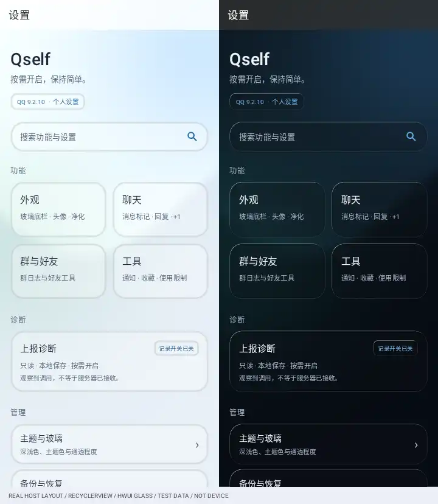

# 设置首页收窄修复与光学玻璃

## 用户实测推翻了上一版的验收结论

用户提供的 PLC110 / ColorOS 16 截图显示：3059 版首页挤在左侧，文字换行并被裁切。
上一轮把单独 View 强制以 EXACTLY 宽度渲染，绕过了真正的父容器测量，不能证明手机布局正常。
把那一版称为“完成”不合适；其渐变透明卡片也不应被称为真正的液态玻璃。

## 本次修改

- 在测试中复现旧 LinearLayout 对 AT_MOST 宽度进行内容收缩的行为。
- `SettingsListLayout` 明确约束真实 Fragment 根容器和 RecyclerView 铺满父容器。
- `SettingsHomeItem` 是生产与测试共用的创建/绑定入口：MATCH_PARENT 宽、WRAP_CONTENT 高。
- 首页在有界测量时使用父容器给出的可用宽度，不再让加权卡片参与首页的收缩定宽；高度正常按内容增长。
- 单/双列依据实际容器宽度和字体缩放选择；窗口缩放会重新排布，双列卡片等高。
- 删减营销式标题，保留原生控件、搜索、配置与返回逻辑，不改功能开关和 O3 配置。

## 材质不是只调透明度

Android 13+ 的硬件路径使用 AGSL RuntimeShader：同一设置背景场景的模糊采样、圆角 SDF 边缘折射、轻微色散和定向高光。
文字、开关与图标单独绘制，不被模糊。此处不是“已完整采用 Material 3 全部组件”的声明。

- 采样源仅为模块设置自己的程序化背景，不捕获 QQ 聊天、系统壁纸或其他应用。
- 设置窗口在挂载内容前显式请求硬件加速，避免沿用 QQ 代理 Activity 的软件窗口属性。
- 实際滚动时更新材质坐标，没有后台常驻动画或定时刷新。
- 实色模式、旧 API 和软件 Canvas 使用安全基础表面；软件回退不冒称光学折射。

## 自动验证方式

使用真实宿主布局 XML → 相同的 SettingsListLayout → RecyclerView → 相同的 SettingsHomeItem，
不再用强制设置首页 View 宽度的长图替代容器验证。

验证包括：

- 320 / 360 / 412 / 480 的容器宽度；1 / 1.3 / 2 倍字体；AT_MOST 与 EXACTLY 的多轮测量。
- 真实列表项宽度、子项边界、文字高度、双列等高、窗口缩放后的单/双列重排。
- 滚动到末尾可触及“关于”，再滚回顶部；重绑定与原有入口分发。
- RenderNode → HardwareRenderer → ImageReader 的 HWUI 光学绘制，确认不是软件路径的透明卡片回退。
- 着色器编译、折射输出、绘制边界和软件截图回退。

自动测试不能代替 PLC110 上的最终复验，不能宣称所有 QQ 注入场景、键盘和系统手势都已真机验收。

## 构建与交付

本次源码：`9851e7f6a494bb58cfc9966e4181fa0791bef73e`。

- [下载修正版 APK](https://github.com/Sumicya/Qself/actions/runs/34676311071/artifacts/10291973592)
- [完整 Gradle 单测通过](https://github.com/Sumicya/Qself/actions/runs/34676311070)：**17 项界面测试，0 失败、0 错误**；另有 **6 项设置源码检查 + 9 项诊断/版本检查**。
- [APK 构建及实际包审计通过](https://github.com/Sumicya/Qself/actions/runs/34676311071)。两项 CI 对应同一源码提交。

| 项目 | 实际产物 |
| --- | --- |
| 包名 | `io.github.qauxv` |
| 版本 | `1.6.1.r3064.9851e7f` |
| versionCode | **3064**，正常 Git 提交计数 |
| 文件 | `app-debug.apk`，17,798,390 字节 |
| APK SHA-256 | `82b1e0db457c0bba74caeb08e256a8e1f5011de9695b5319fe73f31311b89c21` |
| 签名证书 SHA-256 | `d5d015a1bb172b686f3f13883f6994a18fe01e04a53cd30da4dc923e3bea65e9` |
| 可调试 | false |
| 元数据 | targetApiVersion=102，autoHotReload=false |
| 内容检查 | arm64 原生加载器、诊断、既有底栏玻璃、设置光学材质和共用布局/列表项均在包内；无 AppCenter SDK 描述符 |
| 下载到期 | `2026-09-19T05:54:00Z` |

仍是 CI 测试签名，和上一包的证书不同，不冒称固定发行签名。安装前保留模块配置备份，更新后完整重启 QQ；不要求清除 QQ 数据。

## 实际容器的渲染证据

这是同一提交的实际宿主布局 XML、列表容器和首页列表项经 HWUI 接口渲染的**视口**拼图；底部项目需滚动，测试已覆盖滚到“关于”并返回顶部。
CI 使用主机图形后端，不等于 ColorOS GPU 驱动或手机系统栏已经实测。图片含固定测试数据并做了传输压缩，没有采集用户账号或消息。

本次确认的是：旧收窄路径已复现并被修复、真实容器和光学绘制回归通过、对应 APK 已完成审计。不能据此宣称已替用户完成真机验收，更不代表掉线问题已解决。
